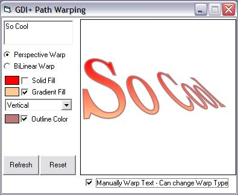



## FYI: GDI\+ Path Warps \(17 Jan 08\)

### Description

Example using GDI+ to warp string paths. GDI+ has two warping options but one is buggy. The attached code is basically a revised c++ post found on codeguru and combined with other ideas. Limited to simple paths only, the class can be modified by you to include other things like shapes, images, etc. Must have GDI+ to run project. 17Jan08: Added more path functions, added another Warp mode (common skew), a few more examples, and minor stuff.
 
### More Info
 

             |
---                |---
**Submitted On**   |2008-01-16 22:50:02
**By**             |[LaVolpe](https://github.com/Planet-Source-Code/PSCIndex/blob/master/ByAuthor/lavolpe.md)
**Level**          |Intermediate
**User Rating**    |5.0 (65 globes from 13 users)
**Compatibility**  |VB 6\.0
**Category**       |[Graphics](https://github.com/Planet-Source-Code/PSCIndex/blob/master/ByCategory/graphics__1-46.md)
**World**          |[Visual Basic](https://github.com/Planet-Source-Code/PSCIndex/blob/master/ByWorld/visual-basic.md)
**Archive File**   |[FYI\_\_GDI\+\_2097811162008\.zip](https://github.com/Planet-Source-Code/lavolpe-fyi-gdi-path-warps-17-jan-08__1-69917/archive/master.zip)

